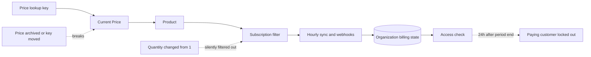

# Handoff: cloud billing hardening (issue #1459)

Branch: `feat-cloud-payment-system-1459`. Written 2026-09-29 after reviewing the Stripe setup for robustness against abuse, pricing mistakes and bugs.

This file is a working note. Do not commit it to the PR.

## Where things stand

The architecture is sound and does not need rework:

- Webhooks verify the signature on the raw body, deduplicate by event ID in `stripe_webhook_event`, and enqueue a job. The job re-reads current Stripe state instead of trusting the event payload, so delayed, duplicated and out-of-order events are safe.
- `claimBillingSync` / `updateSubscriptionProjection` use a claim token so an older sync cannot overwrite a newer one.
- An hourly `billing.lifecycle` job re-syncs every org with a Stripe Customer and sends trial reminders.
- Trials are single-use, both locally and via the Stripe subscription-history check. Resubscribing never grants a trial.
- A trial ending without a card pauses the subscription. No data is deleted anywhere.
- OSS never builds a Stripe client (`getStripeClient` checks `isCloudBillingEnabled()`).

Tests: 116 billing tests pass. `tests/billing-consistency.queries.test.ts` fails locally only because `better-sqlite3` needs `npm rebuild` for the current Node version.

## Must fix before going live

### 1. Unlimited cardless trials

`apps/backend/src/services/stripe.service.ts` line 160:

```ts
payment_method_collection: hasTrial ? 'if_required' : 'always',
```

Every signup gets a personal org (`initializePersonalOrganization`), and each org can start a 14-day trial without a card. A new email address means another free trial. If nao pays for LLM usage in cloud, this is a direct cost.

Fix: use `'always'`. Stripe then collects a card at trial start, and Radar / card fingerprints make repeat trials visible. After that change, `hasDefaultPaymentMethod` is true for every new trial, so the cardless branches in `cloud-billing-access.service.ts` and the "add a payment method" UI only matter for edge cases (card removed in the Portal).

Alternative if cardless trials are a product requirement: keep `'if_required'` but cap trial spend with the existing budget system.

### 2. `past_due` grants access with no end date

`apps/backend/src/services/cloud-billing-access.service.ts` lines 53-54:

```ts
case 'past_due':
	return true;
```

How long this lasts depends only on the Stripe dashboard retry setting. If the final action is "leave past due", a non-paying customer keeps access forever.

Fix, in both places:

- Stripe Dashboard: Billing, Revenue recovery, Retries. Set the final action to "cancel subscription" (or "mark as unpaid").
- Code: limit `past_due` to `isAfter(entitlement.currentPeriodEndsAt, now)`. Stripe advances the period when renewal fails, so this caps free access at one period even if the dashboard is misconfigured.
- Update the `'past due while Stripe retries'` case in `tests/cloud-billing-access.service.test.ts` and add one expired `past_due` case.

### 3. A price change or pricing mistake can lock out all paying customers

`listCloudSubscriptions` and `getCloudSubscription` (`stripe.service.ts` lines 286-305) decide which subscriptions are nao Cloud by looking at the Product of whatever Price `STRIPE_CLOUD_MONTHLY_PRICE_LOOKUP_KEY` points to right now.



Failure modes:

- Old Price archived before the lookup key changes, or lookup key put on a Price under another Product: every sync fails or finds no subscription. The stored state stops updating and access ends 24 hours after each customer's period end.
- Subscription quantity changed from 1 (Dashboard or Portal): `hasProduct` drops it silently and the customer loses access.
- Lookup key accidentally put on a wrong Price: the only checks are EUR, monthly, licensed, amount > 0, so it would sell at that amount.

Fix:

- Add `STRIPE_CLOUD_PRODUCT_ID` to `env.ts` (required when billing is enabled, next to the other three Stripe variables) and `.env.example`.
- Use it in `hasProduct` / `listCloudSubscriptions` / `getCloudSubscription` / `cloudSubscriptionProjection` / `getCloudBillingPlans` instead of `price.product`, so recognising subscriptions no longer depends on the sellable Price.
- In `fetchCloudMonthlyPrice`, reject a Price whose Product is not `STRIPE_CLOUD_PRODUCT_ID`.
- Make a cloud-product subscription with quantity other than 1 throw (so it shows up in logs and alerts) instead of being filtered out.
- In the Portal configuration, make sure quantity changes are disabled.
- Update `docs/cloud-billing-stripe.md`: the "Product and Price" and "Change the price" sections currently say the Product ID is not validated.

### 4. No VAT handling (needs decision)

Checkout has no `automatic_tax`, no `tax_id_collection`, and no required billing address. For EU B2B at this price, you need the buyer's VAT ID for reverse-charge invoices.

Fix once decided, in `createSubscriptionCheckoutSession`:

```ts
automatic_tax: { enabled: true },
tax_id_collection: { enabled: true },
billing_address_collection: 'required',
```

`customer_update: { address: 'auto', name: 'auto' }` is already there, which Stripe Tax needs. Stripe Tax has to be activated in the Dashboard first, and it charges a fee per transaction. Check the options with Context7 or the Stripe docs before implementing. Also decide whether prices are tax-inclusive or tax-exclusive (`tax_behavior` on the Price).

### 5. USD or EUR (needs decision)

Issue #1459 and the feature rule say $2,000/month. `CLOUD_MONTHLY_PLAN.currency` in `apps/backend/src/types/billing.ts` is `'eur'`, and the runbook says EUR 200000. A Stripe customer cannot switch currency once they have been billed, so settle this before the first real customer.

## Lower priority

- **Test events in production.** `routes/stripe-webhook.ts` line 30 rejects live events outside prod but accepts test events in prod. Change it to `if (event.livemode !== (env.MODE === 'prod'))`.
- **Two active subscriptions freeze sync.** `selectCloudSubscription` in `billing-reconciliation.service.ts` throws when a customer has more than one active subscription (created in the Dashboard, or a stale open Checkout completed later). That customer's state then never updates. Option: on `checkout.session.completed`, expire the other open cloud sessions for that customer.
- **No alerting.** Sync and webhook failures only go to `logger.error`. With few clients, alert (Slack or email) on repeated failures or on webhook rows unprocessed for more than an hour.
- **Enforcement is spread out.** About 25 `assertProjectCloudBillingAccess` call sites. No gap found today (MCP `execute_sql`, sub-agents and channel integrations are covered), but any new LLM feature must remember to add one. Consider moving it into `agentService.create` plus one tRPC middleware.

## Dead code to delete

Migration `0070_organization_billing` exists only on this branch, so no production org can have a pre-Stripe "legacy" trial. Remove:

- `createLegacyCloudTrialCheckoutForAdmin` in `billing-management.service.ts`
- `createLegacyTrialCheckoutSession` and `legacyTrialWindowActive` in `trpc/billing.routes.ts`
- the legacy branches in `apps/frontend/src/hooks/use-organization-billing.ts` and `components/settings/organization-billing-settings.tsx` (`legacyTrialCheckout`, `legacyTrialWindowActive`, `legacyTrialCheckoutError`)
- the `'trial'` / `'subscription'` fallbacks in `matchesCheckoutKind` (`stripe.service.ts`)
- the `trialEndsAt` / `STRIPE_CHECKOUT_MIN_TRIAL_MS` path in `createSubscriptionCheckoutSession` once nothing passes a `trialEndsAt`
- the related tests in `tests/billing.routes.test.ts`, `tests/billing-management.service.test.ts` and `tests/stripe.service.test.ts`

Leave the `v2` / `v4` suffixes on idempotency keys alone unless you are already editing those lines. Changing them is harmless but adds nothing.

## Suggested order for tomorrow

1. Decide items 4 (VAT) and 5 (currency).
2. Delete the dead legacy code first, so the rest of the diff is smaller.
3. Fix item 3 (product ID pin), then item 2 (`past_due` limit), then item 1 (card required).
4. Set the Stripe Dashboard settings: retry final action, Portal quantity disabled, Stripe Tax if chosen.
5. Update `docs/cloud-billing-stripe.md` to match (it has Mermaid diagrams that must stay accurate).
6. Verify:

```bash
npm rebuild better-sqlite3
npm run -w @nao/backend test
npm run lint
```

7. In Stripe sandbox with a test clock: trial with card through to first paid invoice, failed renewal through to cancellation, and a Price change with the old Price archived (existing subscriptions must stay entitled).

No new migration is needed for any of this. `STRIPE_CLOUD_PRODUCT_ID` is an environment variable, not a column.
