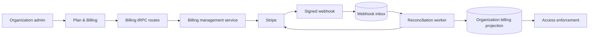
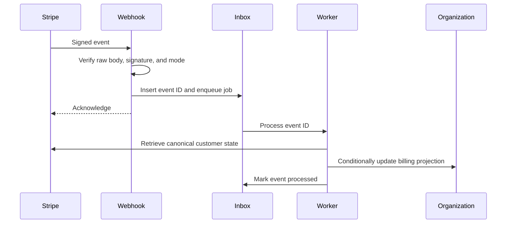
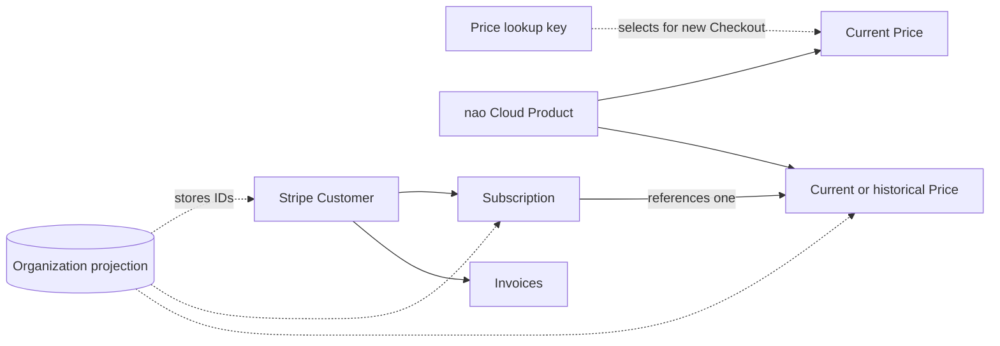
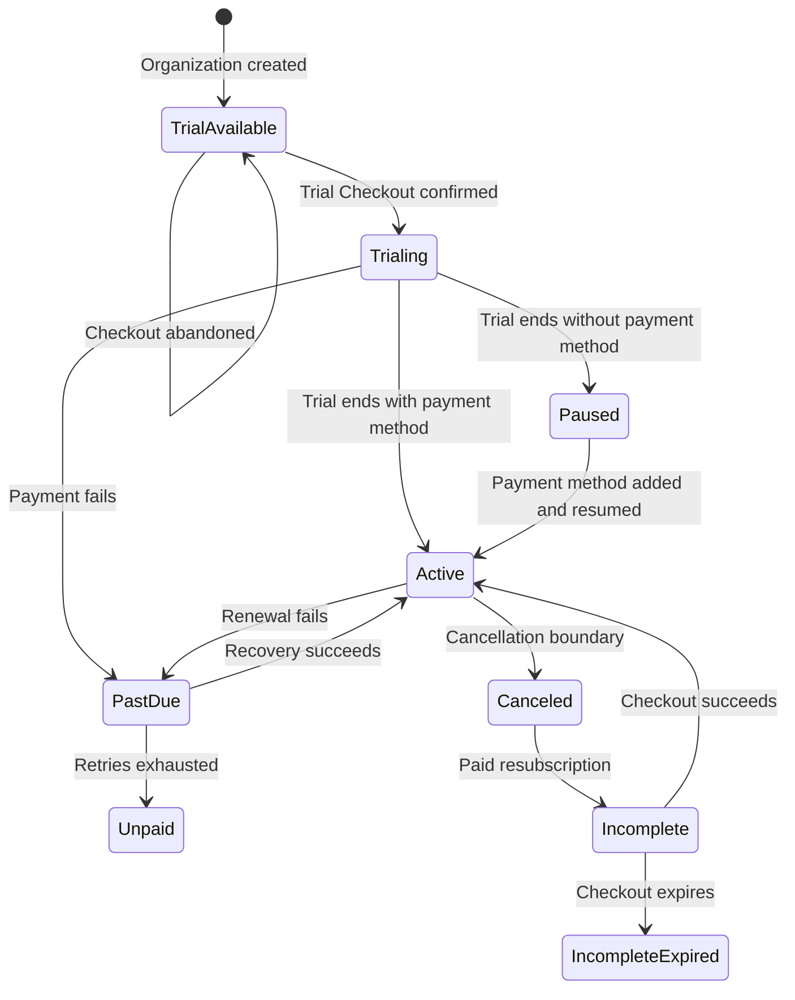

# nao Cloud billing with Stripe

This runbook covers Stripe configuration, deployment, testing, and recovery for organization billing in nao Cloud.

## Scope

- Billing belongs to an organization.
- The plan is EUR 2,000 per month with unlimited users.
- An organization admin can activate one 14-day trial, add payment details, view invoices, manage or cancel the subscription, and recover a paused subscription.
- Billing restrictions preserve all customer data.
- Self-hosted deployments never construct a Stripe client or enforce cloud billing.

Billing is enabled only when both settings are present:

```env
NAO_MODE=cloud
CLOUD_BILLING_ENABLED=true
```

When billing is disabled, billing procedures return `NOT_FOUND`, Stripe routes and jobs do not start, and application access remains unrestricted.

## Runtime overview



Stripe is the source of truth. Webhooks trigger reconciliation from canonical Stripe state; the application does not apply webhook payloads directly. The local organization projection supports access checks and UI queries. Interactive management requires an organization admin, checked at both the route and service boundaries.



## Configure Stripe

### Product and Price

Create one active Product named `nao Cloud` with one active recurring Price:

- currency: `EUR`;
- unit amount: `200000`;
- interval: monthly;
- usage type: licensed;
- quantity: `1`;
- lookup key: a versioned value such as `nao_cloud_monthly_v3`.

The lookup key is nao's sole selector for both the Price and its Product. Assign it only to a Price under the intended `nao Cloud` Product. nao validates that the selected Price and Product are active and that the Price is monthly, licensed, and in EUR. It does not validate the Product ID or name.



### Customer Portal

Configure the Customer Portal to:

- update payment methods, billing addresses, and tax IDs as required;
- display and download invoices;
- cancel at the end of the current period;
- preserve an active trial when subscription details change;
- return to `/settings/organization/billing`;
- disable plan switching while only one plan exists.

Set `STRIPE_PORTAL_CONFIGURATION_ID` when nao should use a specific Portal configuration. Otherwise, nao uses the Stripe account default.

### Emails and retries

Enable the required Stripe receipts, payment-action messages, failed-payment recovery, expiring-card notices, and cancellation confirmations. nao sends its own trial-ending reminder.

Configure Smart Retries deliberately. The Stripe retry policy determines how long a `past_due` organization remains entitled.

### Webhook

Register:

```text
POST https://<cloud-domain>/api/billing/stripe/webhook
```

Subscribe to:

- `checkout.session.completed`
- `checkout.session.async_payment_succeeded`
- `customer.updated`
- `payment_method.attached`
- `payment_method.detached`
- `payment_method.updated`
- `customer.subscription.created`
- `customer.subscription.updated`
- `customer.subscription.deleted`
- `customer.subscription.paused`
- `customer.subscription.resumed`
- `customer.subscription.trial_will_end`
- `invoice.paid`
- `invoice.payment_failed`
- `invoice.payment_action_required`
- `invoice.finalization_failed`

Pin the webhook destination to the API version configured in `stripe.service.ts`.

## Configure the server

```env
NAO_MODE=cloud
CLOUD_BILLING_ENABLED=false
STRIPE_SECRET_KEY=
STRIPE_CLOUD_MONTHLY_PRICE_LOOKUP_KEY=nao_cloud_monthly_v3
STRIPE_WEBHOOK_SECRET=
STRIPE_PORTAL_CONFIGURATION_ID=
```

`STRIPE_SECRET_KEY`, `STRIPE_CLOUD_MONTHLY_PRICE_LOOKUP_KEY`, and `STRIPE_WEBHOOK_SECRET` are required when cloud billing is enabled. The Portal configuration ID is optional.

Keep sandbox and live credentials separate. Store secrets in the deployment secret manager, never in source control, logs, client bundles, database rows, or analytics.

## Lifecycle and access

Creating an organization does not start its trial or call Stripe. An admin activates the trial through zero-due Checkout. Opening or abandoning Checkout does not consume the trial or grant access; signed Stripe state must confirm the subscription.

At trial expiry:

- a usable payment method allows Stripe to begin paid billing;
- no payment method pauses the subscription and restricts access;
- an admin can add a payment method through the Portal and resume the subscription.

Cancellation takes effect at the configured billing boundary. Access continues until that boundary. A canceled or incomplete-expired subscription can start paid Checkout again without another trial.

Full access is available during a confirmed trial, an entitled active subscription, or Stripe's `past_due` recovery period. Missing or expired trials and `unpaid`, `paused`, `incomplete`, `incomplete_expired`, or `canceled` subscriptions restrict cost-producing execution.

Restricted organizations retain authentication, organization administration, billing and recovery actions, project deployment, and read-only access to existing customer data. Subscription changes never delete organization data or Stripe history.



## Change the price

Stripe Prices are immutable. Create a replacement Price under the existing `nao Cloud` Product with a new versioned lookup key.

1. Create and verify the replacement Price in sandbox.
2. Leave the previous Price active during the rollback window.
3. Update `STRIPE_CLOUD_MONTHLY_PRICE_LOOKUP_KEY` and restart or redeploy nao.
4. Verify the Plan & Billing page and a newly created Checkout.
5. Repeat with the equivalent live-mode Product and Price.

The setting affects only Checkout sessions created after the change. Existing subscriptions and earlier Checkout sessions retain their Price. Migrating existing subscriptions is a separate Stripe operation that requires an explicit effective date and proration policy.

To roll back new sales, restore the previous lookup key and redeploy. Keep the shared Product and historical Prices because reconciliation uses Product identity to recognize current and historical subscriptions.

## Deploy and roll back

1. Back up the target database using the environment's normal process.
2. Verify `DB_URI`.
3. Apply pending migrations with `npm run db:migrate -w @nao/backend`.
4. Deploy with `CLOUD_BILLING_ENABLED=false`.
5. Configure the sandbox Product, Price, Portal, emails, retries, and webhook destination.
6. Enable billing in a non-production cloud environment.
7. Validate signed webhook delivery to `/api/billing/stripe/webhook`.
8. Exercise trial activation, renewal, failure, cancellation, replay, and recovery.
9. Configure equivalent live Stripe objects and secrets.
10. Enable production gradually and monitor reconciliation.

To disable billing enforcement, set `CLOUD_BILLING_ENABLED=false` and redeploy. This does not remove billing state, webhook inbox rows, organizations, or Stripe subscriptions.

## Test in sandbox

Forward Stripe events to the backend:

```bash
stripe listen --forward-to localhost:5005/api/billing/stripe/webhook
```

Use Stripe Billing test clocks to exercise:

- cardless trial Checkout and abandoned Checkout;
- payment-method updates;
- trial pause and resume;
- successful renewals and failed payments;
- cancellation and resubscription;
- duplicate or delayed events;
- webhook downtime and recovery;
- Dashboard-side subscription changes.

Useful test cards:

- `4242 4242 4242 4242`: successful payment;
- `4000 0000 0000 3220`: 3D Secure;
- `4000 0000 0000 0002`: generic decline;
- `4000 0000 0000 9995`: insufficient funds;
- `4000 0000 0000 0341`: attaches successfully, then declines when charged.

Use a future expiry date and any three-digit CVC.

Run the automated billing tests before deployment:

```bash
npm run -w @nao/backend test
npm run lint
```

## Operations and recovery

Monitor:

- repeated webhook failures and old unprocessed inbox rows;
- invoice finalization failures;
- Customer or organization mapping conflicts;
- unknown Products;
- Stripe API error spikes;
- reconciliation drift;
- failed trial reminders.

Recovery must support replaying an inbox event, resending an Event from Stripe Workbench, rotating secrets, correcting a Customer mapping, and disabling enforcement without erasing state.

Security requirements:

- verify webhooks against the unmodified request body;
- keep Stripe keys server-side;
- keep Customer and Subscription IDs out of browser responses; admin invoice responses include invoice IDs, display fields, and hosted document URLs;
- use idempotency keys for mutations;
- validate Customer, Subscription, Product, organization metadata, and live mode;
- never log complete Stripe objects, webhook bodies, secrets, card data, billing addresses, or tax IDs.

## References

- [Build subscriptions with Checkout](https://docs.stripe.com/payments/checkout/build-subscriptions)
- [Subscription trials](https://docs.stripe.com/billing/subscriptions/trials)
- [Subscription webhooks and statuses](https://docs.stripe.com/billing/subscriptions/webhooks)
- [Webhook security](https://docs.stripe.com/webhooks)
- [Customer Portal](https://docs.stripe.com/customer-management)
- [Billing test clocks](https://docs.stripe.com/billing/testing/test-clocks)
- [Smart Retries](https://docs.stripe.com/billing/revenue-recovery/smart-retries)
- [Secret-key best practices](https://docs.stripe.com/keys-best-practices)
