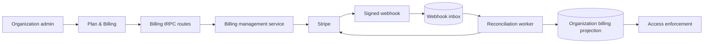
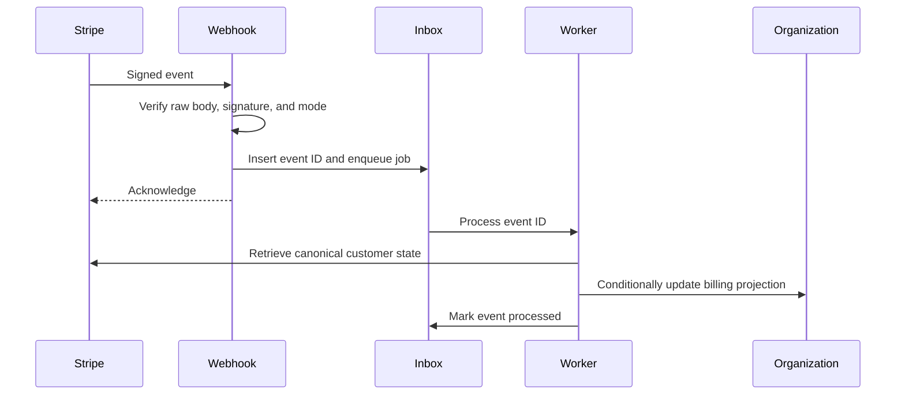
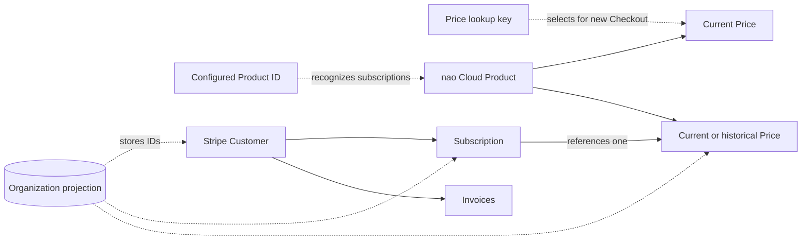
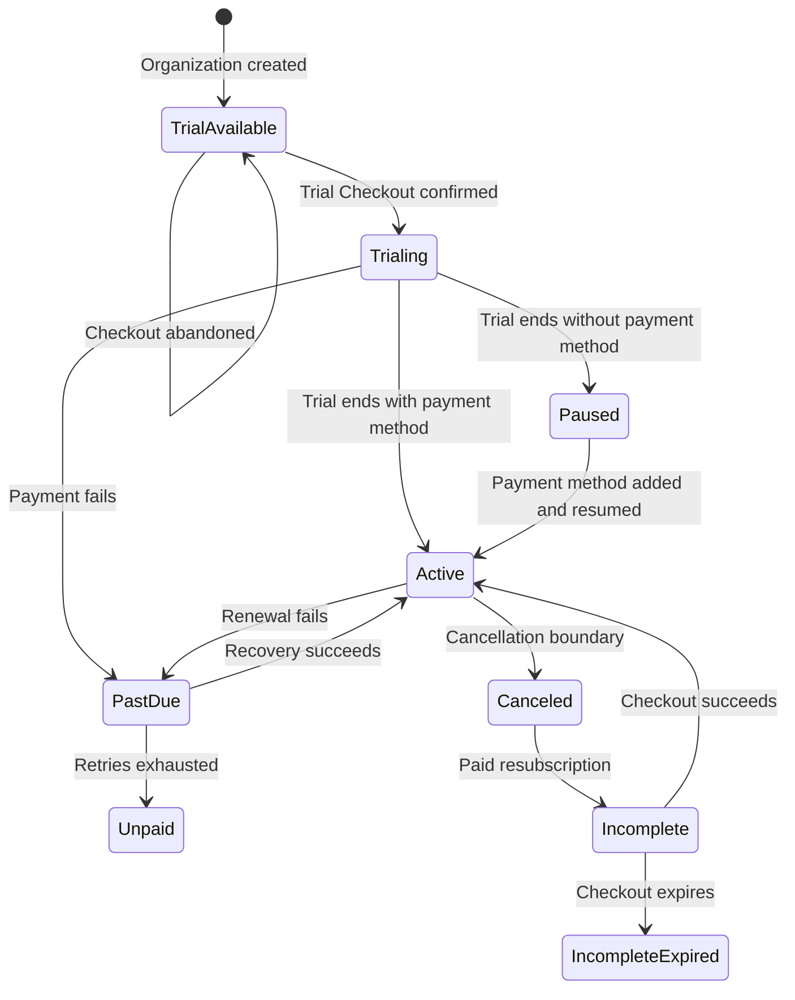
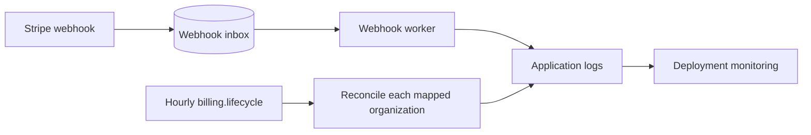

# nao Cloud billing with Stripe

This runbook covers Stripe configuration, deployment, testing, and recovery for organization billing in nao Cloud.

## Scope

- Billing belongs to an organization.
- The plan is USD 2,000 per month with unlimited users.
- An organization admin can activate one 14-day trial, add payment details, view invoices, manage or cancel the subscription, and recover a paused subscription.
- Billing restrictions preserve all customer data.
- Self-hosted deployments never construct a Stripe client or enforce cloud billing.

Billing is enabled only when both settings are present:

```env
NAO_MODE=cloud
CLOUD_BILLING_ENABLED=true
```

When billing is disabled, billing procedures return `NOT_FOUND`, Stripe routes and jobs do not start, and application access remains unrestricted.

## Runtime overview



Stripe is the source of truth. Webhooks trigger reconciliation from canonical Stripe state; the application does not apply webhook payloads directly. The local organization projection supports access checks and UI queries. Interactive management requires an organization admin, checked at both the route and service boundaries.



## Configure Stripe

### Product and Price

Create one active Product named `nao Cloud` with one active recurring Price:

- currency: `USD`;
- unit amount: `200000`;
- interval: monthly;
- usage type: licensed;
- quantity: `1`;
- lookup key: a versioned value such as `nao_cloud_monthly_v3`.

Record the Product ID and assign the lookup key only to a Price under that Product. nao validates both identities independently, along with the active Product, monthly interval, licensed usage type, and USD currency.

Checkout always sells quantity `1`. nao recognizes a subscription by its Product, not its quantity, so a quantity changed in the Dashboard never revokes access.



### Tax

Checkout enables automatic tax, requires a billing address, and collects business tax IDs. Checkout creation fails until Stripe Tax is active in the matching Stripe account:

1. Activate Stripe Tax and set the origin address.
2. Add a tax registration for each jurisdiction where nao must collect tax.
3. Set the Product tax code for SaaS and the Price tax behavior to exclusive.
4. Enable tax ID display on invoices.

With exclusive pricing, Stripe adds tax to the USD 2,000 amount where required and applies reverse charge when a valid business tax ID makes it applicable.

### Customer Portal

Configure the Customer Portal to:

- update payment methods, billing addresses, and tax IDs as required;
- display and download invoices;
- cancel at the end of the current period;
- preserve an active trial when subscription details change;
- return to `/settings/organization/billing`;
- disable plan switching and quantity changes while only one plan exists.

Set `STRIPE_PORTAL_CONFIGURATION_ID` when nao should use a specific Portal configuration. Otherwise, nao uses the Stripe account default.

### Stripe-hosted customer emails and retries

In **Billing → Subscriptions and emails**, let Stripe send all billing lifecycle emails:

- enable the free-trial ending reminder; Stripe sends it three days before the trial ends;
- enable successful payment receipts;
- enable failed-payment and payment-action-required emails;
- enable expiring-card reminders;
- enable cancellation confirmations.

Configure Stripe branding, public business details, support contact, and the customer-facing statement descriptor before enabling these emails. nao does not send billing emails and does not require SMTP for billing.

Stripe sends these messages to the Stripe Customer email. nao sets that address from the organization admin who first creates the billing Customer. Change the Customer email in Stripe if billing notifications should go to a shared finance inbox.

Configure Smart Retries deliberately and set the final action to cancel the subscription or mark it unpaid. nao restricts access as soon as Stripe reports the subscription as `past_due`.

### Trial abuse

Trial Checkout requires and saves a card, but this alone does not block repeated trials. The abuse control must also be enabled directly in every Stripe sandbox and live account:

1. In **Radar Settings**, enable Radar for payment methods saved for future use.
2. Under **Radar → Risk controls**, enable **Free trial abuse**.
3. Review Stripe's backtest before enabling the control in live mode.
4. Monitor blocked trial attempts in the Dashboard.

`CLOUD_BILLING_ENABLED=true` does not configure Radar. Do not enable cloud billing for customers until the matching Stripe account has this control enabled.

The application prevents a second trial for the same organization and Stripe Customer. It does not detect a person creating another account and personal organization. Radar must provide the cross-account, card, device, and risk signals for that case.

### Abuse-control ownership

Production protection is split across Stripe, deployment infrastructure, and nao:

- **Stripe Dashboard:** enable Radar for saved payment methods, Free trial abuse, Smart Retries, billing emails, and a locked Customer Portal with plan switching and quantity changes disabled.
- **Stripe dispute policy:** define how disputes, fraudulent charges, and refunds affect the subscription. The current webhook handler does not consume dispute or refund events. Use a tested Stripe Workflow or add application handling that moves the subscription to a status nao restricts.
- **Deployment infrastructure:** rate-limit authenticated billing procedures by user and organization. The backend uses authorization and Stripe idempotency keys but does not include a billing endpoint rate limiter. Do not apply the same tight limit to signed Stripe webhooks, which must remain available for Stripe retries.
- **nao application:** validates organization ownership, Product identity, webhook signatures and mode, and restricts access for non-entitled subscription statuses.
- **Usage controls:** Stripe billing does not limit compute consumption or account sharing for an entitled organization. Any such limits belong to application or infrastructure usage controls.

### Webhook

Register:

```text
POST https://<cloud-domain>/api/billing/stripe/webhook
```

Subscribe to:

- `checkout.session.completed`
- `checkout.session.async_payment_succeeded`
- `customer.updated`
- `payment_method.attached`
- `payment_method.detached`
- `payment_method.updated`
- `customer.subscription.created`
- `customer.subscription.updated`
- `customer.subscription.deleted`
- `customer.subscription.paused`
- `customer.subscription.resumed`
- `invoice.paid`
- `invoice.payment_failed`
- `invoice.payment_action_required`
- `invoice.finalization_failed`

Pin the webhook destination to the API version configured in `stripe.service.ts`.

nao rejects events whose mode differs from `STRIPE_SECRET_KEY`: live events require a `sk_live_` or `rk_live_` key, and test events require a test key. `MODE` does not affect this check.

## Configure the server

```env
NAO_MODE=cloud
CLOUD_BILLING_ENABLED=false
STRIPE_SECRET_KEY=
STRIPE_CLOUD_PRODUCT_ID=prod_example
STRIPE_CLOUD_MONTHLY_PRICE_LOOKUP_KEY=nao_cloud_monthly_v3
STRIPE_WEBHOOK_SECRET=
STRIPE_PORTAL_CONFIGURATION_ID=
```

`STRIPE_SECRET_KEY`, `STRIPE_CLOUD_PRODUCT_ID`, `STRIPE_CLOUD_MONTHLY_PRICE_LOOKUP_KEY`, and `STRIPE_WEBHOOK_SECRET` are required when cloud billing is enabled. The Portal configuration ID is optional.

Keep sandbox and live credentials separate. Store secrets in the deployment secret manager, never in source control, logs, client bundles, database rows, or analytics.

## Lifecycle and access

Creating an organization does not start its trial or call Stripe. An admin activates the trial through Checkout, which saves a card for renewal and lets Stripe Radar block high-risk repeated trials before access starts. Opening or abandoning Checkout does not consume the trial or grant access; signed Stripe state must confirm the subscription.

At trial expiry:

- a usable payment method allows Stripe to begin paid billing;
- a card removed during the trial causes Stripe to pause the subscription and nao to restrict access;
- an admin can add a payment method through the Portal and resume the subscription.

Cancellation takes effect at the configured billing boundary. Access continues until that boundary. A canceled or incomplete-expired subscription can start paid Checkout again without another trial.

Full access is available during a confirmed trial or an entitled active subscription. Missing or expired trials and `past_due`, `unpaid`, `paused`, `incomplete`, `incomplete_expired`, or `canceled` subscriptions restrict cost-producing execution.

Restricted organizations retain authentication, organization administration, billing and recovery actions, project deployment, and read-only access to existing customer data. Subscription changes never delete organization data or Stripe history.



## Change the price

Stripe Prices are immutable. Create a replacement USD Price under the Product identified by `STRIPE_CLOUD_PRODUCT_ID`, with a new versioned lookup key.

1. Create and verify the replacement Price in sandbox.
2. Leave the previous Price active during the rollback window.
3. Update `STRIPE_CLOUD_MONTHLY_PRICE_LOOKUP_KEY` and restart or redeploy nao.
4. Verify the Plan & Billing page and a newly created Checkout.
5. Repeat with the equivalent live-mode Product and Price.

The lookup-key setting affects only Checkout sessions created after the change. Existing subscriptions and earlier Checkout sessions retain their Price, amount, and currency and remain recognized by the configured Product ID. Migrating existing subscriptions is a separate Stripe operation that requires an explicit effective date and proration policy.

To roll back new sales, restore the previous lookup key and redeploy. Do not change `STRIPE_CLOUD_PRODUCT_ID`; keep the Product and historical Prices because reconciliation uses Product identity to recognize current and historical subscriptions.

## Production go-live checklist

Complete the sandbox setup and test-clock scenarios first. Then switch the Stripe Dashboard to live mode and repeat every account-level setting because sandbox and live configurations are independent:

1. Activate Stripe Tax, set the business origin, add required registrations, and verify invoice tax-ID display.
2. Create the live `nao Cloud` Product and exclusive USD 2,000 monthly Price. Record the Product ID and lookup key.
3. Configure the live Customer Portal: payment methods, billing addresses, tax IDs, invoices, and end-of-period cancellation enabled; plan switching and quantity changes disabled.
4. Configure Stripe branding, public business details, support contact, statement descriptor, trial-ending reminders, receipts, failed-payment messages, payment-action messages, expiring-card reminders, and cancellation confirmations.
5. Configure Smart Retries with the final action set to cancel or mark unpaid.
6. Enable Radar for payment methods saved for future use, review the live backtest, and enable Free trial abuse.
7. Configure and test the dispute, fraud, and refund policy. Confirm it transitions affected subscriptions to a status nao restricts, or implement the missing application event handling before launch.
8. Configure edge rate limits for authenticated billing procedures by user and organization without blocking normal Stripe webhook retries.
9. Create the live webhook destination with the exact event list above and API version from `stripe.service.ts`. Record its live `whsec_...` signing secret.
10. Store the live secret key, Product ID, lookup key, webhook secret, and optional Portal configuration ID in the production secret manager.
11. Back up the target database, verify `DB_URI`, apply migrations, and deploy with `CLOUD_BILLING_ENABLED=false`.
12. Confirm the application starts, `POST /api/billing/stripe/webhook` is absent while disabled, `billing.*` tRPC procedures return `NOT_FOUND`, and the live key and webhook secret belong to the same Stripe mode and account.
13. Set `CLOUD_BILLING_ENABLED=true`, redeploy, create one controlled live subscription, and verify Checkout tax, the saved card, webhook processing, the Stripe trial email, Portal access, and invoice rendering.
14. Monitor application logs, rate-limit metrics, disputes, refunds, Radar blocks, and Stripe Workbench during the rollout.

To disable billing enforcement, set `CLOUD_BILLING_ENABLED=false` and redeploy. This does not remove billing state, webhook inbox rows, organizations, or Stripe subscriptions.

## Test in sandbox

Forward Stripe events to the backend:

```bash
stripe listen --forward-to localhost:5005/api/billing/stripe/webhook
```

Use Stripe Billing test clocks to exercise:

- card-required trial Checkout, Radar-blocked trial abuse, and abandoned Checkout;
- Stripe's trial-ending email three days before expiry;
- payment-method updates;
- trial pause and resume;
- successful renewals and failed payments;
- cancellation and resubscription;
- the configured dispute and refund response;
- duplicate or delayed events;
- webhook downtime and recovery;
- Dashboard-side subscription changes.

Also verify that the Customer Portal cannot switch plans or quantities and repeated billing requests are throttled at the edge.

Useful test cards:

- `4242 4242 4242 4242`: successful payment;
- `4000 0000 0000 3220`: 3D Secure;
- `4000 0000 0000 0002`: generic decline;
- `4000 0000 0000 9995`: insufficient funds;
- `4000 0000 0000 0341`: attaches successfully, then declines when charged.

Use a future expiry date and any three-digit CVC.

Run the automated billing tests before deployment:

```bash
npm run -w @nao/backend test
npm run lint
```

## Operations and recovery



If a Customer has multiple current cloud subscriptions, reconciliation logs an error but continues with one deterministic subscription: the strongest status wins (`active`, then `trialing`, then `past_due`), the already-projected subscription breaks equal-status ties, and the oldest subscription is the final tie-breaker. Cancel the unintended subscription in Stripe to stop duplicate billing.

Monitor:

- repeated webhook job failures and unprocessed inbox rows;
- invoice finalization failures;
- Customer or organization mapping conflicts;
- unknown Products;
- Stripe API error spikes;
- reconciliation drift;
- disputes and refunds;
- billing endpoint rate-limit rejections;
- failed Stripe email delivery.

Recovery must support replaying an inbox event, resending an Event from Stripe Workbench, rotating secrets, correcting a Customer mapping, and disabling enforcement without erasing state.

Security requirements:

- verify webhooks against the unmodified request body;
- keep Stripe keys server-side;
- keep Customer and Subscription IDs out of browser responses; admin invoice responses include invoice IDs, display fields, and hosted document URLs;
- use idempotency keys for mutations;
- validate Customer, Subscription, Product, organization metadata, and live mode;
- never log complete Stripe objects, webhook bodies, secrets, card data, billing addresses, or tax IDs.

## References

- [Build subscriptions with Checkout](https://docs.stripe.com/payments/checkout/build-subscriptions)
- [Subscription trials](https://docs.stripe.com/billing/subscriptions/trials)
- [Subscription webhooks and statuses](https://docs.stripe.com/billing/subscriptions/webhooks)
- [Webhook security](https://docs.stripe.com/webhooks)
- [Customer Portal](https://docs.stripe.com/customer-management)
- [Billing test clocks](https://docs.stripe.com/billing/testing/test-clocks)
- [Free trial abuse prevention](https://docs.stripe.com/radar/free-trial-abuse)
- [Dispute automation](https://docs.stripe.com/disputes/responding)
- [Smart Retries](https://docs.stripe.com/billing/revenue-recovery/smart-retries)
- [Secret-key best practices](https://docs.stripe.com/keys-best-practices)
